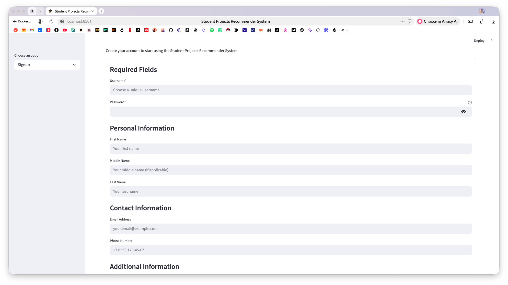
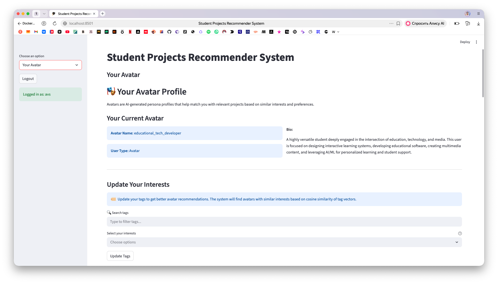
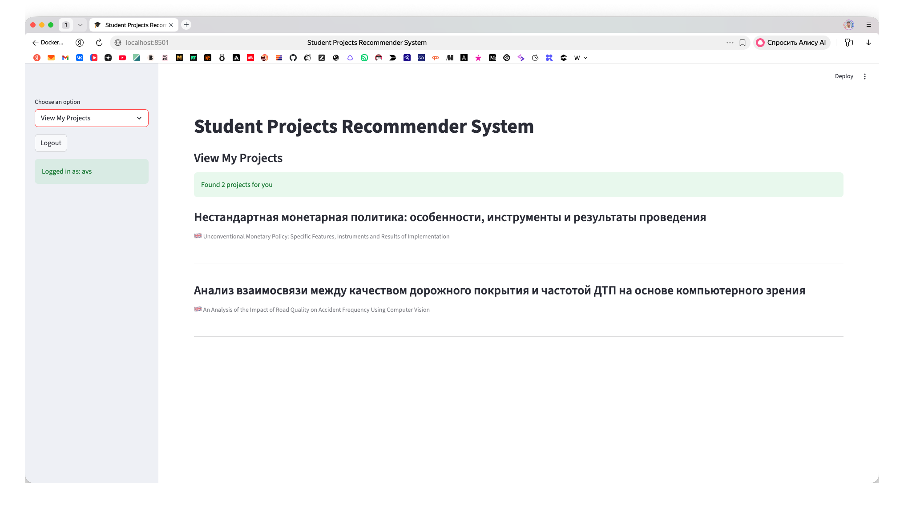
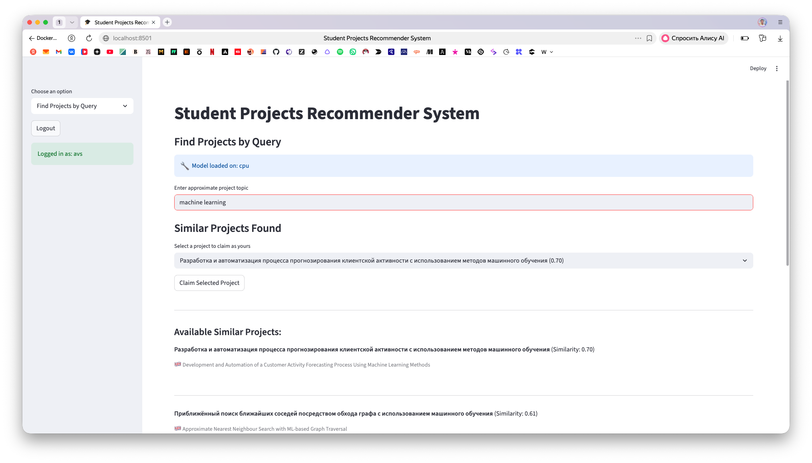
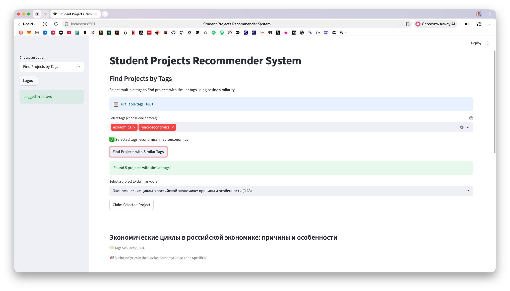
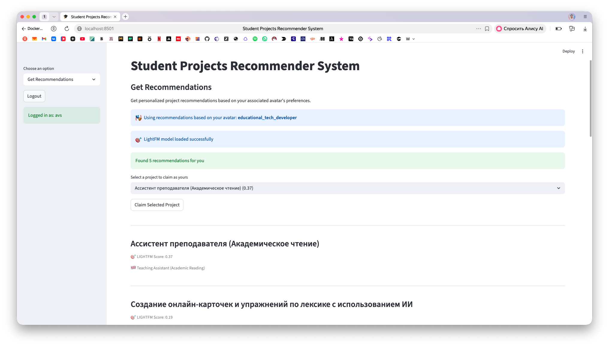

# Student Projects Recommender System

FastAPI backend with Streamlit frontend and PostgreSQL database, featuring intelligent project recommendations using multiple ML algorithms (LightFM, Transformers) and an avatar-based persona system.

## Quick Start

```bash
# Start all services
docker compose up --build

# Access services
# Frontend: http://localhost:8501
# Backend: http://localhost:8080
# Backend docs: http://localhost:8080/docs
```

## Features

### User Management
- **JWT Authentication** - Secure user authentication with token-based access
- **Profile Management** - Full user profiles with personal information, bio, and contact details
- **User Types** - Support for student, teacher, and admin user types
- **Avatar System** - AI-generated persona profiles that help match users with relevant projects

### Project Management
- **Full CRUD Operations** - Create, read, update, and soft delete projects
- **Automatic Embedding Generation** - Projects get 384-dimensional embeddings using transformer models
- **Tags Support** - Each project can have multiple tags from a predefined set (1861 tags)
- **Project Claiming** - Users can claim projects as their own
- **Rating System** - 1-5 star ratings for projects

### Search & Recommendations
- **Semantic Search** - Transformer-based search using `sentence-transformers/paraphrase-multilingual-MiniLM-L12-v2`
- **Tags-Based Search** - Cosine similarity search on project tag vectors
- **LightFM Recommendations** - Collaborative filtering using the user's avatar's preferences
- **Popular Items** - Highly rated projects for cold-start users

### Avatar System
- **AI-Generated Personas** - Pre-configured avatar profiles with different interests
- **Avatar Assignment** - Automatic avatar assignment based on user's tag similarity
- **Avatar Recommendations** - Tag-based cosine similarity to find matching avatars
- **Avatar Switching** - Users can change their associated avatar

### Database & Infrastructure
- **PostgreSQL + pgvector** - Optimized vector database for embeddings and tags
- **Docker-Optimized** - Multi-container setup with health checks and resource limits
- **Connection Pooling** - Configurable database connection pooling

## Screenshots

### Signup


### Your Avatar


### View My Projects


### Find Projects by Query


### Find Projects by Tags


### Get Recommendations


## Development

### Implemented Features
- Complete user authentication flow with JWT tokens
- User profile management with CRUD operations
- Avatar system with auto-assignment and manual selection
- Project CRUD operations with automatic embedding and tags generation
- Semantic project search using transformer models
- Tags-based search using cosine similarity
- Multiple recommendation algorithms (LightFM, Popular)
- User profile and project claiming functionality
- Project rating system (1-5 stars)
- Tag management for users and projects
- Database initialization with project embeddings
- Soft delete functionality

### ML Models Used
- **Transformer Model**: `sentence-transformers/paraphrase-multilingual-MiniLM-L12-v2` (384-dim embeddings)
- **LightFM**: Collaborative filtering with avatar-based preferences
- **Cosine Similarity**: For both embeddings and tag vectors

## Architecture

```
├── docker-compose.yaml           # Multi-service orchestration
├── recsAppBack/                 # FastAPI backend
│   ├── app/
│   │   ├── main.py             # Application entry point
│   │   ├── config.py            # Configuration settings
│   │   ├── auth/                # JWT authentication
│   │   ├── db/                  # Database layer with pgvector
│   │   ├── handlers/            # API endpoints
│   │   │   ├── projects.py      # Project CRUD and ratings
│   │   │   ├── users.py         # User management
│   │   │   ├── avatars.py       # Avatar recommendations
│   │   │   ├── tags.py          # Tag management
│   │   │   └── profile.py       # User profile
│   │   ├── models/              # Pydantic data models
│   │   └── utils/               # Utility functions
│   └── requirements.txt
├── recsAppFront/                # Streamlit frontend
│   ├── app/
│   │   ├── streamlit.py         # Main application
│   │   ├── config.py            # Configuration settings
│   │   └── handlers/            # ML and auth utilities
│   │       ├── transformers.py  # ML models (LightFM, Transformers)
│   │       └── auth_helpers.py  # Authentication helpers
│   └── requirements.txt
├── recsAppInit/                 # Data initialization service
│   ├── app/
│   │   ├── main.py              # Embedding generation
│   │   ├── config.py            # Configuration settings
│   │   └── models.py            # Data models
│   └── requirements.txt
└── data/                        # Resources directory
    ├── data.xlsx                # Project data
    ├── item_embeddings.pkl      # Pre-computed embeddings
    ├── titles_with_tags_dict.pkl # Project-tag mappings
    ├── tags_set.pkl             # All available tags
    └── resources/
        └── lightfm_sber_model.pkl  # Trained LightFM model
```

## Database Schema

### Users Table
- `id` - UUID primary key
- `nick_name` - Unique username
- `first_name`, `middle_name`, `last_name` - User's full name
- `email_address`, `phone_number` - Contact information
- `self_bio` - User biography
- `user_type` - student, teacher, or admin
- `avatar_id` - FK to associated avatar user
- Soft delete support with `deleted_at`

### Projects Table
- `id` - UUID primary key
- `title_rus` - Russian title (required)
- `title_eng` - English title
- `annotation` - Short description
- `description` - Full description
- `embedding` - 384-dim vector (pgvector)
- `tags` - 1861-dim vector (pgvector)
- `chosen_by` - FK to user who claimed the project
- Soft delete support with `deleted_at`

### Ratings Table
- `id` - UUID primary key
- `user_id` - FK to users table
- `project_id` - FK to projects table
- `rating` - Integer 1-5
- Unique constraint on (user_id, project_id)

### Tags, UserTags, ProjectTags Tables
- Support for many-to-many relationships between users/projects and tags

## API Endpoints

### Public
- `POST /profile/signup` - Create user account
- `POST /token` - Get JWT token (OAuth2 password flow)
- `GET /` - Service health check

### Protected (JWT required)

#### Projects
- `GET /projects/` - List all projects (simplified view)
- `GET /projects/with-embeddings` - List projects with embeddings for similarity search
- `GET /projects/with-tags` - List projects with tags for tag-based search
- `GET /projects/user/{user_id}` - Get projects by user
- `GET /projects/{project_id}` - Get specific project details
- `POST /projects/` - Create new project (auto-generates embeddings)
- `PUT /projects/{project_id}` - Update project (claim ownership)
- `DELETE /projects/{project_id}` - Soft delete project
- `POST /projects/rate` - Rate a project (1-5 stars)
- `GET /projects/{project_id}/rating` - Get user's rating for a project
- `GET /projects/{project_id}/ratings` - Get all ratings for a project
- `GET /projects/ratings/all` - Get all ratings (for ML model training)

#### Users
- `GET /users/` - List all users with optional type filter
- `GET /users/avatars` - List all avatar users
- `GET /users/{user_id}` - Get specific user

#### Avatars
- `GET /avatars/my` - Get current user's associated avatar
- `GET /avatars/recommend` - Get avatar recommendations based on user's tags
- `GET /avatars/` - List all avatars
- `GET /avatars/{avatar_id}` - Get specific avatar
- `PUT /avatars/select/{avatar_id}` - Associate user with avatar

#### Tags
- `GET /tags/` - List all tags
- `GET /tags/{tag_id}` - Get specific tag
- `GET /tags/user/{user_id}` - Get user's tags
- `GET /tags/project/{project_id}` - Get project's tags
- `POST /tags/user/{user_id}` - Add tags to user
- `DELETE /tags/user/{user_id}` - Delete user's tags

#### Profile
- `GET /profile/me` - Get user profile

## Configuration Details

### Backend Config (`recsAppBack/app/config.py`)
- Database settings and connection pooling
- JWT authentication configuration
- API and security settings
- ML/embedding model configuration

### Frontend Config (`.streamlit/secrets.toml`)
- Backend connection settings
- UI customization options
- ML model and caching configuration
- Performance tuning parameters

### Init Service (`recsAppInit/app/config.py`)
- Database connection settings
- Data file paths
- Embedding model configuration
- Batch processing settings

## Technology Stack

- **Backend**: FastAPI with SQLAlchemy ORM
- **Frontend**: Streamlit
- **Database**: PostgreSQL with pgvector extension
- **ML/ML Models**:
  - Sentence Transformers for embeddings
  - LightFM for collaborative filtering
  - Scikit-learn for similarity calculations
- **Containerization**: Docker & Docker Compose
